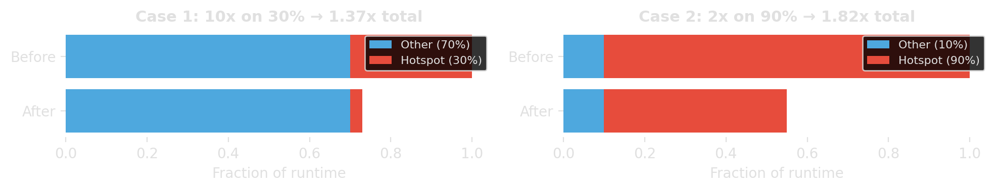

# Block 1: Find the Bottleneck {background-image="assets/symbol_find_the_bottleneck.png" background-opacity="0.3" background-size="cover" background-color="#2d4059"}

Before tuning anything, we need two guardrails:
**Amdahl's law** and **"premature optimization is the root of all evil."**

<!-- Sources for Foundations:
     - Amdahl's law: standard textbook, also in README.md outline §1
     - Knuth quote: Knuth, "Structured Programming with go to Statements",
       ACM Computing Surveys 6(4), Dec 1974, p.268. CiteSeerX 10.1.1.103.6084
     - Knuth photo: Alex Handy, CC BY-SA 2.0, Wikimedia Commons
     - Chart: generated with matplotlib (gen_amdahl.py)
-->
## Amdahl's law: know the ceiling

If fraction $p$ of runtime can be improved by factor $s$, then

$$
\text{speedup} = \frac{1}{(1-p) + \frac{p}{s}}
$$

::: {.fragment}
{width="90%"}
:::

::: {.fragment}
::: {.platypus-tip}
Speed up the part that dominates runtime, not the part that looks embarrassing.
:::
:::

## "Premature optimization is the root of all evil"

:::: {.columns}
::: {.column width="70%"}

> "We should forget about small efficiencies, say about 97% of the time:
> **premature optimization is the root of all evil.**
> Yet we should not pass up our opportunities in that critical 3%."

::: {.source-note}
Donald Knuth, "Structured Programming with go to Statements", ACM Computing Surveys, 1974. [@knuth1974structured]
:::

&nbsp;

::: {.fragment}
This quote does **not** mean "performance does not matter."
It means: optimize **after** you know where the real bottleneck is.
:::

:::

::: {.column width="30%"}
{width="80%"}

::: {.source-note}
Photo: Alex Handy, CC BY-SA 2.0
:::
:::
::::

