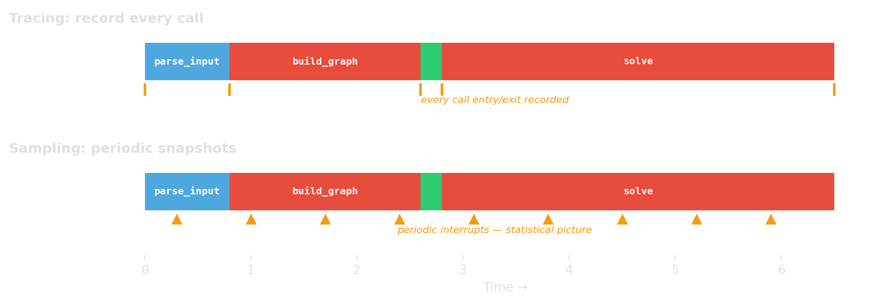
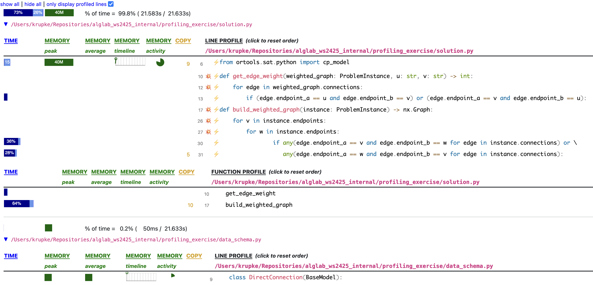
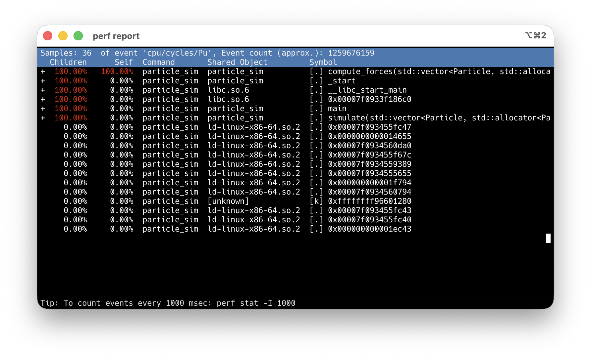
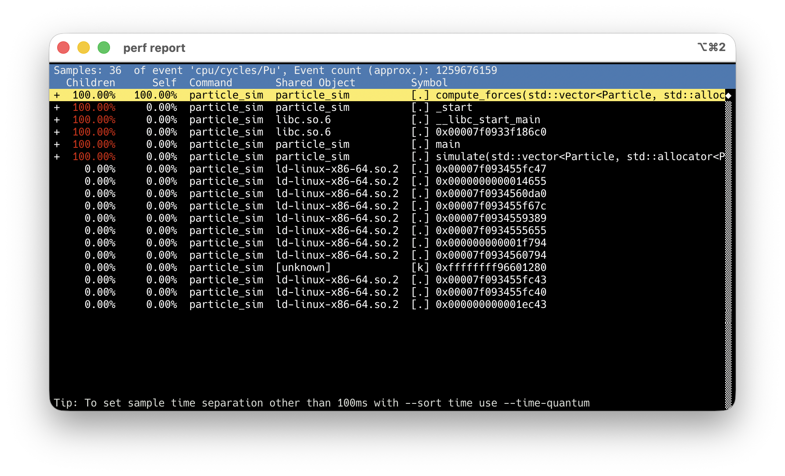
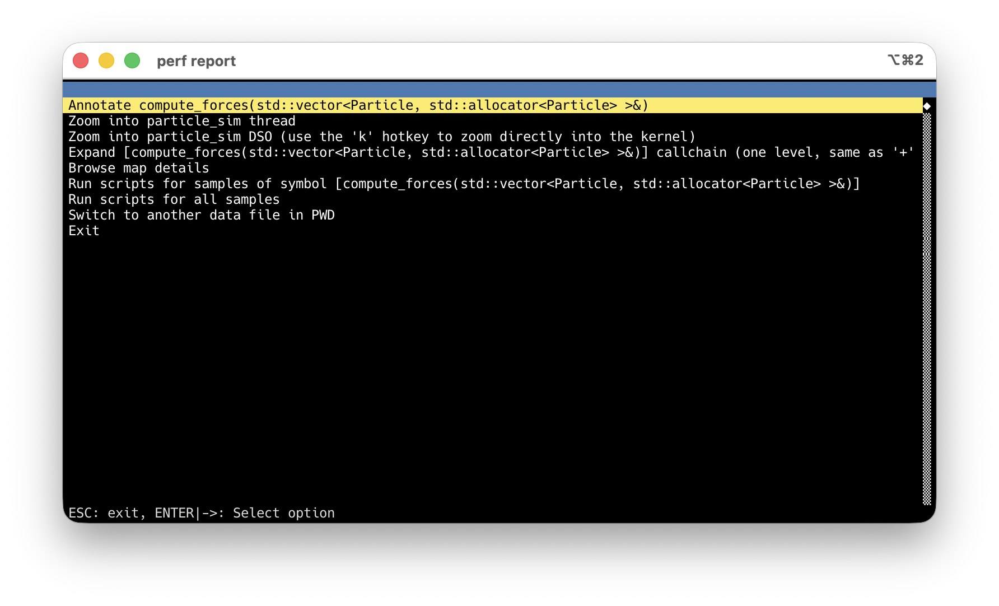
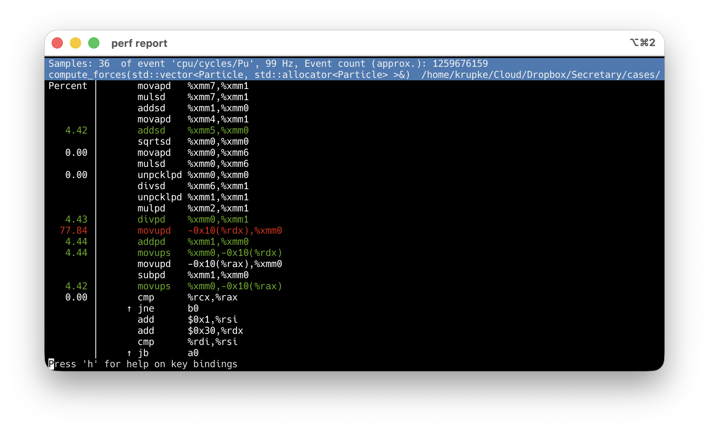

<!-- Sources for Profiling:
     - Profiler taxonomy, tracing vs sampling, cProfile, Scalene:
       ../deep-research-report-profilers.md (§2-3)
     - Scalene usage, --program-path, Windows caveat:
       /home/krupke/Repositories/AlgLab-WS2526-material/sheets/01_cpsat/exercises/01_profiling_exercise/README.md
     - Scalene screenshot: ../images/scalene_example.png (from AlgLab exercise)
     - Tracing vs sampling diagram: generated with matplotlib (gen_tracing_sampling.py)
     - Python profiling workflow: ../python-benchmarking.md §4-7
     - perf stat output: measured on Ryzen 9 9900X running
       examples/google_benchmark/build/benchmarks/bm_graph
-->
# Profiling {background-image="assets/symbol_profiling.png" background-opacity="0.3" background-size="cover" background-color="#2d4059"}

Logging tells us **where to look**.
Profilers tell us **how the cost is distributed inside the code**.

## Two big families

{width="95%"}

:::: {.columns}

::: {.column width="48%"}
**Tracing / instrumentation**

- record every call or event
- exact call counts, higher overhead
- Python example: `cProfile`
:::

::: {.column width="4%"}
:::

::: {.column width="48%"}
::: {.fragment}
**Sampling**

- interrupt periodically
- statistical estimate, lower overhead
- Python example: `Scalene`
:::
:::

::::

## What does "time" even mean?

::: {.incremental}
- **CPU time**: time while the program is actually running on CPU
- **wall-clock time**: elapsed real time, including waiting
- **on-CPU profiles** can miss I/O waits and blocking
- mixed Python/native systems may need a split like **Python vs native vs system**
:::

::: {.fragment}
If a Python program spends a lot of time waiting or inside native libraries,
**the profiler must match that reality.**
:::

## A practical rule of thumb

::: {.incremental}
1. start with **logging** to find the slow phase
2. use **Scalene** for line-level Python vs native insight
3. use **cProfile** when you want exact call counts and call paths
4. if the hotspot is in native code, use native profilers (`perf`, VTune)
:::

::: {.fragment}
::: {.platypus-tip}
Start broad and cheap. Go narrower only where the evidence points.
:::
:::

## cProfile: when you want exact call counts

```{.bash code-line-numbers="1|2|3"}
python -m cProfile -s tottime my_script.py       # whole script
python -m cProfile -s tottime -o prof.dat my_script.py  # save for pstats
python -m cProfile -s cumtime my_script.py        # sort by cumulative
```

::: {.fragment}
```text
   ncalls  tottime  percall  cumtime  percall filename:lineno(function)
     1225    3.712    0.003    3.712    0.003 solver.py:42(build_graph)
        1    1.204    1.204    1.204    1.204 solver.py:89(solve)
     1225    0.847    0.001    0.847    0.001 solver.py:31(distance)
```
:::

::: {.fragment}
`build_graph` called **1225 times** — if you expected once, that is the bug.
**Trust call counts from cProfile.** Treat timing as approximate; tracing adds overhead.
:::

## cProfile: targeted profiling

```{.python code-line-numbers="1-3|5-9|10-11"}
# Profile just one function call
import cProfile
cProfile.run("build_graph(data)", sort="tottime")

# Profile a specific section with the context manager
with cProfile.Profile() as pr:
    result = build_graph(data)
    solution = solve(result)

pr.print_stats(sort="tottime")     # print to stdout
pr.dump_stats("profile.dat")       # save for later analysis
```

::: {.fragment}
```text
         2374431 function calls (828274 primitive calls) in 0.757 seconds

   Ordered by: internal time

   ncalls  tottime  percall  cumtime  percall filename:lineno(function)
   206534    0.514    0.000    0.514    0.000 cp_model.py:537(add_all_different)
1752679/206535    0.214    0.000    0.221    0.000 profile_solver.py:39(_extend)
   206535    0.012    0.000    0.232    0.000 profile_solver.py:34(enumerate_all_cliques)
        1    0.010    0.010    0.242    0.242 cp_model.py:333(new_int_var)
```
:::

## Scalene: when you want line-level insight (wall-clock, Python/native split)

```bash
pip install scalene
python -m scalene --html --program-path . --output profile.html my_script.py
```

::: {.incremental}
- `--program-path .` — only profile **your** code, not libraries (crucial!)
- `--html --output profile.html` — generate a browsable HTML report
- without `--program-path`, the output is dominated by library internals
:::

## Reading Scalene output

{width="95%"}

::: {.fragment}
For each file, Scalene shows per-line and per-function time.
Here, `build_weighted_graph` takes **64%** — and line 30 alone takes **36%**.
:::

## C++ profiling with `perf`

Profiling C++ is more painful than Python — but the payoff is a view all the way down to the hardware.

::: {.incremental}
- `perf` reads the CPU's own counters: cycles, cache misses, branch mispredictions
- You see not just **where** the CPU spent time, but **why** it spent it there
- No code changes, no recompile beyond `-g` for symbols
:::

::: {.source-note}
Walkthrough example: `examples/perf_record/`
:::

<!-- Practical note for students: perf is Linux-only (install via linux-tools-common
     or linux-perf). If you get "Permission denied", your kernel restricts hardware
     counters for non-root users. Fix with:
         sudo sysctl kernel.perf_event_paranoid=1
     (or =0 for full access). Add to /etc/sysctl.conf to make persistent.
     On university compute servers, ask the admin. -->

## `perf` answers two questions

::: {.incremental}
- **What kind of bottleneck is this?** — compute, memory, branches, kernel, waiting
  - **count** events across the run → `perf stat`
- **Where in the code does it land?** — function, line, call path
  - **sample** the program counter → `perf record`
:::

::: {.fragment}
::: {.platypus-tip}
Full program → `perf record` first to find the hotspot.
Isolated benchmark → `perf stat` first to classify the bottleneck.
But beware: an isolated benchmark may behave differently — warm caches, no memory pressure from surrounding code.
:::
:::

## `perf stat` — classify

```bash
perf stat -r 5 -e cycles,instructions,cache-references,cache-misses,\
                  branches,branch-misses ./my_program
```

::: {.fragment}
```text
 106,492,298,140  cycles
  19,885,322,792  instructions          #  0.19 IPC
   1,169,144,985  cache-references
     460,783,901  cache-misses          # 39.4%
   3,898,830,400  branches
     363,147,163  branch-misses         #  9.3%
```
:::

::: {.incremental}
- **IPC** (instructions per cycle) is the first-order signal — 0.19 means the CPU is mostly stalled
- Read IPC **together with** total instructions and wall time — not alone
- Vectorizing can *raise* CPI while making code faster (fewer instructions, same work)
- `-r 5` repeats the run and reports variance — use it for any measurement you'll act on
:::

## Read the signature, not the number

::: {.fragment}
Individual counters rarely diagnose. **Patterns across counters** do.

| Pattern | Counter signature | Likely cause |
|---|---|---|
| Compute-bound | High IPC, low miss rate | Instruction count / algorithm |
| Memory-bound | Low IPC, miss pressure high | Locality, data layout |
| Branch-heavy | Branch-miss % high on *hot* code | Unpredictable conditionals |
| Kernel-heavy | `cycles:k` comparable to `cycles:u` | Syscalls, I/O path |
| **Off-CPU** | `task-clock` ≪ wall time | Waiting, not computing |
:::

::: {.fragment}
::: {.platypus-warning}
Last row is the trap: if `task-clock` ≪ wall time, your program is **blocked, not slow**. You need off-CPU tools (`perf record --off-cpu`, `perf sched`, `perf lock`) — sampling harder won't help.
:::
:::

## `perf record` + `perf report`: find the hotspot

```bash
g++ -O2 -g -std=c++17 -o particle_sim main.cpp   # -g: debug info, no codegen change
perf record -F 99 --call-graph dwarf ./particle_sim
perf report                                       # interactive TUI
```

:::: {.columns}

::: {.column width="65%"}
::: {.r-stack}
{.fragment .fade-out fragment-index=1 width="100%"}

{.fragment .fade-in-then-out fragment-index=1 width="100%"}

{.fragment .fade-in-then-out fragment-index=2 width="100%"}

{.fragment .fade-in-then-out fragment-index=3 width="100%"}

{.fragment .fade-in fragment-index=4 width="100%"}
:::
:::

::: {.column width="35%"}

<!-- adding some space here to push the box a little down -->
&#160;

::: {.fragment fragment-index=5}
::: {.platypus-tip}
`-O2 -g`: debug info maps samples to source lines.
Never use `-O0`.
:::
:::


:::

::: {.r-stack}
::: {.fragment .fade-out fragment-index=1}
`compute_forces` at **100%** Children — every sample goes through it.
:::

::: {.fragment .fade-in-then-out fragment-index=1}
Arrow keys → highlight the hot symbol.
:::

::: {.fragment .fade-in-then-out fragment-index=2}
**Enter** → action menu → **Annotate**.
:::

::: {.fragment .fade-in-then-out fragment-index=3}
Default: asm-only, sample % per instruction.
:::

::: {.fragment .fade-in fragment-index=4}
Press **`s`** → source interleaved. Inlined code too.
:::
:::

::::


