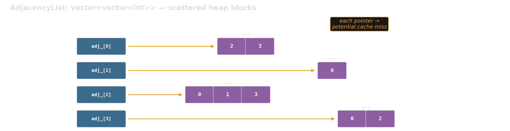
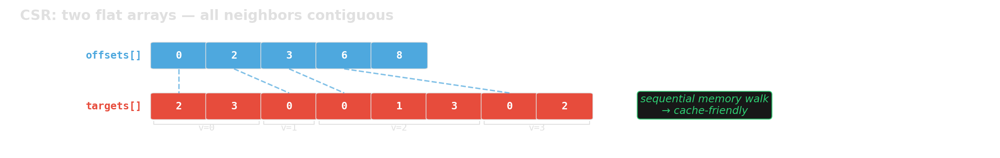

<!-- Sources for Micro-benchmarking:
     - timeit: ../python-benchmarking.md §8, ../deep-research-report-python-performance-tricksd.md §2
     - timeit output: measured on this machine (CPython 3.12, Ryzen 9 9900X)
     - timeit features: repeat(), setup=, CLI from Python docs
     - Google Benchmark code + output: examples/google_benchmark/
       measured on Ryzen 9 9900X, GCC 15, -O2, Release build
     - AdjList vs CSR chart: generated from benchmark output (gen_benchmark_chart.py)
-->
# Micro-benchmarking {background-image="assets/symbol_benchmarking.png" background-opacity="0.3" background-size="cover" background-color="#2d4059"}

Profiling finds **where** the bottleneck is.
Micro-benchmarking measures **whether your fix actually helped**.

## Python: `timeit` — Basic Usage (wall-clock time)

```{.python code-line-numbers="1-2|4-6|7-9"}
import timeit

n = 100_000
t_comp = timeit.timeit(  # returns total seconds for `number` runs
    lambda: [x**2 for x in range(n)], number=50
)
t_map = timeit.timeit(
    lambda: list(map(lambda x: x**2, range(n))), number=50
)
print(f"comprehension: {t_comp:.3f}s   map: {t_map:.3f}s   ratio: {t_comp/t_map:.2f}x")
```

::: {.fragment}
```text
comprehension: 2.261s   map: 3.307s   ratio: 0.68x
```
:::

## C++: Google Benchmark — Our Example

We benchmark **two graph representations** with the same API:

{width="95%"}

::: {.fragment}
{width="95%"}
:::

::: {.fragment}
**Which layout is faster for graph traversal at scale?**
:::

## C++: Google Benchmark — Writing a Benchmark

```{.cpp code-line-numbers="1-4|6-12|13|15"}
static void BM_iterate_neighbors_csr(benchmark::State& state) {
    int n = static_cast<int>(state.range(0));  // parameter from Range()
    auto edges = random_edges(n, num_edges(n));
    auto graph = make_csr(n, edges);           // setup: NOT measured

    for (auto _ : state) {                     // measured loop
        long sum = 0;
        for (int v = 0; v < graph.num_vertices(); v++) {
            for (int u : graph.neighbors(v)) sum += u;
        }
        benchmark::DoNotOptimize(sum);         // prevent dead-code elimination
    }
    state.SetItemsProcessed(state.iterations() * graph.num_edges() * 2);
}
BENCHMARK(BM_iterate_neighbors_csr)->RangeMultiplier(10)->Range(1000, 1000000);
```

::: {.fragment}
::: {style="font-size: 0.7em;"}
| Concept | What it does |
|---------|-------------|
| Setup before loop | Excluded from timing |
| `for (auto _ : state)` | Framework controls iteration count |
| `DoNotOptimize(val)` | Prevents compiler from eliminating unused results |
| `SetItemsProcessed` | Enables throughput reporting (items/s) |
| `Range(lo, hi)` | Sweeps input sizes automatically |
:::
:::

## Google Benchmark: Example Output

```text
Benchmark                                      Time        CPU   UserCounters
BM_iterate_neighbors_adjlist/1000          1,469 ns    1,465 ns   6.82G items/s
BM_iterate_neighbors_csr/1000              1,475 ns    1,472 ns   6.79G items/s
BM_iterate_neighbors_adjlist/1000000   14,541,591 ns  14,497 us   690M items/s
BM_iterate_neighbors_csr/1000000        8,369,209 ns   8,347 us   1.20G items/s
```

::: {.fragment}
At N=1000: both fit in cache — **no difference**.
At N=1M: CSR is **1.7x faster** — memory layout matters.
:::

::: {.fragment}
**Same semantics, different memory behavior** — exactly the kind of result microbenchmarks should explain.
:::

::: {.fragment}
We have a plausible explanation — but **`perf stat`** can turn it into evidence.
:::

::: {.source-note}
Source: `examples/google_benchmark/` — you will get this template.
:::

## Benchmark + `perf stat`: Why Is CSR Faster?

Filter to one case, wrap the binary with `perf stat`:

```bash
perf stat -r 3 -e cycles,instructions,cache-references,cache-misses \
  ./bm_graph --benchmark_filter='BM_iterate_neighbors_adjlist/1000000$' \
             --benchmark_min_time=2s
# repeat with …_csr/1000000$
```

::: {.fragment}
| Counter (per iteration)   |    adjlist |        CSR |       Ratio |
|---------------------------|-----------:|-----------:|------------:|
| time                      |   13.76 ms |    8.39 ms | 1.64× faster |
| instructions / cycle      |       0.29 |       0.37 |       1.26× |
| L1-dcache miss rate       |       8.1% |       5.6% |           — |
| **cache-misses (≈ DRAM)** | **5.02 M** | **1.80 M** | **2.79× fewer** |
:::

::: {.fragment}
**Benchmark tells you *how much*. `perf stat` tells you *why*.**
Roughly 2.8× fewer DRAM-class misses — the pipeline is no longer starved.
:::

::: {.source-note}
Use the generic `cache-references` / `cache-misses` events — `LLC-loads` / `LLC-load-misses` report `<not supported>` on AMD Zen.
:::

## Setting Up Google Benchmark: Project Layout

```{.text}
my_project/
├── CMakeLists.txt              # root: fetch deps, add subdirectories
├── src/
│   ├── CMakeLists.txt          # defines the library target
│   └── graph/
│       ├── graph.h             # your library headers
│       └── graph_gen.h
├── benchmarks/
│   ├── CMakeLists.txt          # benchmark targets, link against library
│   └── bm_graph.cpp
└── tests/
    ├── CMakeLists.txt          # test targets, link against library
    └── test_graph.cpp
```

::: {.fragment}
`src/` defines a **library target**. Benchmarks and tests both link against it —
same include paths, same compile settings, no relative-path `#include` hacks.
:::

## Setting Up: Root `CMakeLists.txt`

```cmake
cmake_minimum_required(VERSION 3.14)
project(my_project LANGUAGES CXX)
include(FetchContent)     # downloads libraries as part of cmake build

# Google Benchmark — fetched automatically, no manual install
FetchContent_Declare(googlebenchmark
    GIT_REPOSITORY https://github.com/google/benchmark.git
    GIT_TAG        v1.9.4)

# Don't build benchmark's own tests (we don't need them)
set(BENCHMARK_ENABLE_TESTING OFF CACHE BOOL "" FORCE)
set(BENCHMARK_ENABLE_INSTALL OFF CACHE BOOL "" FORCE)
FetchContent_MakeAvailable(googlebenchmark)

add_subdirectory(src)          # your library (INTERFACE target)
add_subdirectory(tests)
add_subdirectory(benchmarks)
```

::: {.fragment}
FetchContent downloads + builds Google Benchmark automatically.
Just run `cmake` — **no system-wide installation needed**.
:::

::: {.source-note}
Full example with Google Test: `examples/google_benchmark/CMakeLists.txt`
:::

## Setting Up: `benchmarks/CMakeLists.txt`

```{.cmake}
add_executable(bm_my_algorithm bm_my_algorithm.cpp)

# Link against your library and Google Benchmark.
# my_lib provides include paths + compile settings (e.g., C++20).
# benchmark_main provides main() with built-in CLI flag parsing.
target_link_libraries(bm_my_algorithm my_lib benchmark::benchmark_main)
```

::: {.fragment}
**Build and run:**
```bash
cmake -B build -DCMAKE_BUILD_TYPE=Release    # Release is critical!
cmake --build build
./build/benchmarks/bm_my_algorithm
```
:::

::: {.fragment}
::: {.callout-warning}
**Always use `CMAKE_BUILD_TYPE=Release`.** Debug mode uses `-O0` (no optimization) — your benchmarks will measure unoptimized code and **the results are meaningless**.
:::
:::

::: {.source-note}
Full example: `examples/google_benchmark/benchmarks/CMakeLists.txt` — your existing `src/` and `tests/` stay untouched; benchmarks are additive.
:::

## Google Benchmark: Useful Flags

```{.bash}
# Run only benchmarks matching a regex
./build/benchmarks/bm_graph --benchmark_filter=BFS

# JSON output for scripts/plotting
./build/benchmarks/bm_graph --benchmark_format=json \
                             --benchmark_out=results.json

# Multiple repetitions → mean, median, stddev
./build/benchmarks/bm_graph --benchmark_repetitions=5

# Combine: filter + repetitions + save to file
./build/benchmarks/bm_graph --benchmark_filter=iterate \
                             --benchmark_repetitions=5 \
                             --benchmark_format=json \
                             --benchmark_out=results.json
```

::: {.fragment}
All flags are built into `benchmark_main` — no code changes needed.
:::

