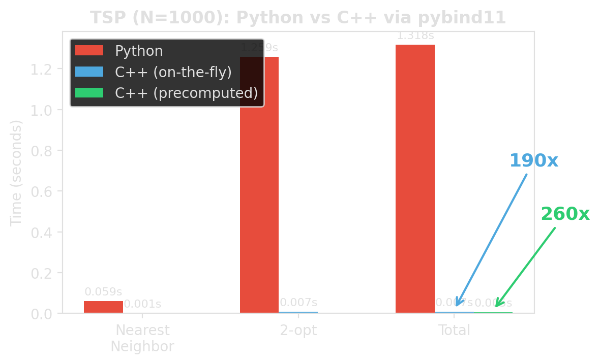

<!-- Sources for pybind11:
     - Template code: ../examples/pybind11_template/
     - Benchmark output (~190x/~260x): measured on this machine running
       examples/pybind11_template/benchmark_python_vs_cpp.py
     - pybind11 v3 API, scikit-build-core, binding patterns:
       ../deep-research-report-pybind11.md
     - Benchmark chart: generated with matplotlib (gen_pybind_chart.py)
-->
# Moving to Native: pybind11 {background-image="assets/symbol_pybind11.png" background-opacity="0.3" background-size="cover" background-color="#2d4059"}

The bottleneck is not "Python".
The bottleneck is the **interpreted loop**.

## When pybind11 is worth it

::: {.incremental}
- Scalene shows most time in **Python execution**
- the hotspot is a **tight inner loop**
- the Python-side implementation is fundamentally loop-heavy
- moving the **whole loop** is realistic
:::

::: {.fragment}
**Our example:** TSP nearest-neighbor + 2-opt local search.
Both are tight O(n^2^) loops over distance computations — exactly the pattern where moving the entire loop to C++ pays off.
:::

::: {.fragment}
::: {.platypus-tip}
If the bottleneck is CPU-bound — especially superlinear algorithms — copying data into C++ and back is often worth it.
The copy cost is linear; the savings are superlinear.
:::
:::

## The measured difference

:::: {.columns}
::: {.column width="50%"}
```text
TSP benchmark, N = 1000

Python:
  Nearest neighbor:  0.059s
  2-opt:             1.259s
  Total:             1.318s

C++ (on-the-fly):
  Nearest neighbor:  0.001s
  2-opt:             0.007s
  Total:             0.007s

C++ (precomputed):
  Total:             0.005s

Tour quality: identical
```
:::

::: {.column width="50%"}
{width="100%"}
:::
::::

::: {.fragment}
::: {.platypus-tip}
Same algorithm. Same result. Roughly **190x / 260x** faster.
Different place where the loop runs.
:::
:::

::: {.source-note}
Source: `examples/pybind11_template/benchmark_python_vs_cpp.py`
:::

## The workflow

::: {.incremental}
1. **Write the algorithm in pure C++** — no pybind11 dependency
2. **Write a thin binding file** — converts Python types to C++ and back
3. **Configure the build** — `pyproject.toml` + `CMakeLists.txt`
4. **Install with pip** — `pip install -e .` builds everything
5. **Import from Python** — `import fast_tsp; fast_tsp.nearest_neighbor(cities)`
:::

::: {.fragment}
```text
my_package/
├── pyproject.toml              # build config (scikit-build-core + pybind11)
├── CMakeLists.txt              # compile the C++ extension
├── src/my_package/
│   ├── algorithm.h / .cpp      # pure C++ (no pybind11 dependency)
│   ├── _bindings.cpp           # thin pybind11 wrapper
│   └── __init__.py             # re-export C++ functions
└── tests/
```
:::

## Step 1: Write the C++ algorithm

```{.cpp code-line-numbers="1-5|7-11|13-33"}
// tsp.h — pure C++, no pybind11 dependency
struct Point {
    double x;
    double y;
};

inline double dist(std::span<const Point> cities, int i, int j) {
    double dx = cities[i].x - cities[j].x;
    double dy = cities[i].y - cities[j].y;
    return std::sqrt(dx * dx + dy * dy);
}

std::vector<int> two_opt_improve(std::span<const Point> cities,
                                  std::vector<int> tour) {
    int n = static_cast<int>(tour.size());
    bool improved = true;
    while (improved) {
        improved = false;
        for (int i = 0; i < n - 1; i++) {
            for (int j = i + 2; j < n; j++) {
                double old_d = dist(cities, tour[i], tour[i+1])
                             + dist(cities, tour[j], tour[(j+1)%n]);
                double new_d = dist(cities, tour[i], tour[j])
                             + dist(cities, tour[i+1], tour[(j+1)%n]);
                if (new_d < old_d - 1e-10) {
                    std::reverse(tour.begin()+i+1, tour.begin()+j+1);
                    improved = true;
                }
            }
        }
    }
    return tour;
}
```

::: {.source-note}
Full code: `examples/pybind11_template/src/fast_tsp/tsp.h`
:::

## Step 2: Write the binding file

```{.cpp code-line-numbers="1-5|7-14|16-17|19-26|28-35|37-46|48-62"}
#include <pybind11/pybind11.h>
#include <pybind11/stl.h>       // auto-convert std::vector <-> Python list
#include <array>
#include "tsp.h"
namespace py = pybind11;

static std::vector<Point> make_points(
    const std::vector<std::array<double, 2>>& cities) {
    std::vector<Point> points;
    points.reserve(cities.size());
    for (const auto& city : cities)
        points.push_back(Point{city[0], city[1]});
    return points;
}

PYBIND11_MODULE(_native, m) {
    m.doc() = "fast_tsp C++ extension — TSP routines via pybind11";

    m.def("nearest_neighbor",
          [](const std::vector<std::array<double, 2>>& cities) {
              auto points = make_points(cities);
              py::gil_scoped_release release;    // let other Python threads run
              return nearest_neighbor(points);   // std::vector<int> → list
          },
          "Nearest neighbor heuristic",
          py::arg("cities"));

    m.def("two_opt_improve",
          [](const std::vector<std::array<double, 2>>& cities,
             std::vector<int> tour) {
              auto points = make_points(cities);
              py::gil_scoped_release release;
              return two_opt_improve(points, std::move(tour));
          },
          py::arg("cities"), py::arg("tour"));

    // Precomputed distance matrix for repeated access (e.g., multi-pass 2-opt)
    py::class_<DistanceMatrix>(m, "DistanceMatrix")
        .def(py::init([](const std::vector<std::array<double, 2>>& cities) {
                 auto points = make_points(cities);
                 return DistanceMatrix(points);
             }),
             py::arg("cities"))
        .def_property_readonly("size", &DistanceMatrix::size)
        .def("query", &DistanceMatrix::operator(),
             py::arg("i"), py::arg("j"));

    // Overloads taking DistanceMatrix instead of coordinates
    m.def("two_opt_improve",
          [](const DistanceMatrix& dm, std::vector<int> tour) {
              py::gil_scoped_release release;
              return two_opt_improve(dm, std::move(tour));
          },
          py::arg("distances"), py::arg("tour"));

    m.def("nearest_neighbor",
          [](const DistanceMatrix& dm) {
              py::gil_scoped_release release;
              return nearest_neighbor(dm);
          },
          py::arg("distances"));
}
```

::: {.source-note}
Source: `examples/pybind11_template/src/fast_tsp/_bindings.cpp`
:::

## Step 3: `pyproject.toml` + `CMakeLists.txt`

The build config has two pybind11-specific parts:

:::: {.columns}
::: {.column width="48%"}
**pyproject.toml** — build system:
```{.toml}
[build-system]
requires = [
  "scikit-build-core>=0.12.2",
  "pybind11>=3.0.3"
]
build-backend = "scikit_build_core.build"

[tool.scikit-build]
wheel.packages = ["src/fast_tsp"]

[tool.scikit-build.cmake]
build-type = "Release"
```
:::
::: {.column width="4%"}
:::
::: {.column width="48%"}
**CMakeLists.txt** — compile the extension:
```{.cmake}
cmake_minimum_required(VERSION 3.15...3.30)
project(${SKBUILD_PROJECT_NAME} LANGUAGES CXX)

set(PYBIND11_FINDPYTHON ON)
find_package(pybind11 3.0 CONFIG REQUIRED)

pybind11_add_module(_native
    src/fast_tsp/tsp.cpp
    src/fast_tsp/_bindings.cpp)

target_compile_features(_native PRIVATE cxx_std_20)
install(TARGETS _native DESTINATION fast_tsp)
```
:::
::::

::: {.fragment}
`pip install -e .` calls scikit-build-core, which calls CMake, which compiles the extension.
The rest of pyproject.toml (`[project]` name, version, dependencies) is standard Python packaging.
:::

::: {.source-note}
Full files: `examples/pybind11_template/pyproject.toml`, `CMakeLists.txt`
:::

## Step 4: `__init__.py` and install

```{.python}
# src/fast_tsp/__init__.py — re-export C++ functions
from fast_tsp._native import nearest_neighbor, two_opt_improve, tour_length
```

::: {.fragment}
**Build and install:**
```bash
pip install -e ".[test]"      # editable install + test deps
```
:::

::: {.fragment}
**Use from Python:**
```python
import fast_tsp

cities = [(0.0, 0.0), (1.0, 0.0), (1.0, 1.0), (0.0, 1.0)]
tour = fast_tsp.nearest_neighbor(cities)           # → list[int]
tour = fast_tsp.two_opt_improve(cities, tour)      # → list[int]
print(f"Tour length: {fast_tsp.tour_length(cities, tour):.1f}")
```
:::

::: {.source-note}
Full template: `examples/pybind11_template/`
:::

## Distributing compiled extensions

::: {.incremental}
- `pip install -e .` works locally — but requires a **C++ compiler + CMake** on the target
- Extensions are **bound to a specific Python version and platform**
- **Wheels** are pre-compiled — `pip install` just unpacks, no build tools needed
- **cibuildwheel** + GitHub Actions automates building wheels for all platforms
:::

::: {.fragment}
::: {.platypus-tip}
For course projects, editable installs are fine.
For packages you share, build wheels in CI so users never need a compiler.
:::
:::

