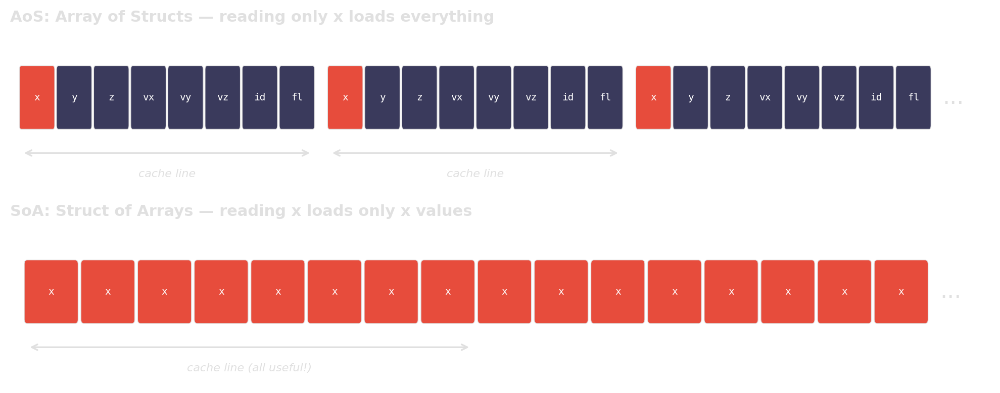

<!-- Sources for C++ Performance Killers:
     - Code patterns and explanations:
       ../deep-research-report-cpp-performance-killers.md (§3: copies, reserve, erase,
       AoS/SoA, unordered_map; §4: dedup O(n²))
     - Additional context: ../deep-research-report-cpp-tuning.md (§4: cache efficiency,
       §6: micro-optimizations)
     - All benchmark numbers measured on Ryzen 9 9900X, GCC 15, -O2
       using Google Benchmark (examples/cpp_killers/):
       copies (21x): BM_copy_by_value vs BM_copy_by_ref
       reserve (2.4x): BM_push_back_no_reserve vs BM_push_back_reserve
       erase-remove (344x): BM_erase_in_loop vs BM_erase_remove
       AoS vs SoA (1.9x): BM_aos_sum_x vs BM_soa_sum_x
       dedup (89x): BM_dedup_naive vs BM_dedup_sort_unique
       pointer chasing (29x–1500x): BM_sum_linked_list[_shuffled] vs BM_sum_vector
       set vs sorted vector (up to 6x): BM_lookup_set vs BM_lookup_sorted_vector
     - AoS/SoA diagram: generated with matplotlib (gen_aos_soa_diagram.py)
     - Summary chart: generated with matplotlib (gen_summary_charts.py)
-->
# C++ Performance Killers {background-image="assets/symbol_cpp_killers.png" background-opacity="0.3" background-size="cover" background-color="#2d4059"}

Now the bottleneck is **inside C++**.
Same principle: measure, then fix the right thing.

## Accidental copies: `auto r` vs `const auto& r`

:::: {.columns}
::: {.column width="48%"}
**Slow:**
```{.cpp code-line-numbers="|5"}
struct Record { std::vector<int> payload; };

size_t total(const std::vector<Record>& rs) {
    size_t sum = 0;
    for (auto r : rs)            // copies!
        sum += r.payload.size();
    return sum;
}
```
:::

::: {.column width="4%"}
:::

::: {.column width="48%"}
**Fast:**
```{.cpp code-line-numbers="|5"}
struct Record { std::vector<int> payload; };

size_t total(const std::vector<Record>& rs) {
    size_t sum = 0;
    for (const auto& r : rs)    // no copy
        sum += r.payload.size();
    return sum;
}
```
:::
::::

::: {.fragment}
```text
100k records x 32 ints:
  auto r (copy):       51.9 ms
  const auto& r (ref):  2.4 ms     speedup: 21x
```
:::

::: {.fragment}
::: {.platypus-warning}
One character (`&`) eliminates 100,000 heap allocations per iteration.
:::
:::

## Missing `reserve()` for `push_back`

:::: {.columns}
::: {.column width="48%"}
**Slow:**
```cpp
std::vector<int> build(size_t n) {
    std::vector<int> v;
    for (size_t i = 0; i < n; ++i)
        v.push_back(i);
    return v;
}
```
:::

::: {.column width="4%"}
:::

::: {.column width="48%"}
**Fast:**
```{.cpp code-line-numbers="3"}
std::vector<int> build(size_t n) {
    std::vector<int> v;
    v.reserve(n);
    for (size_t i = 0; i < n; ++i)
        v.push_back(i);
    return v;
}
```
:::
::::

::: {.fragment}
```text
10M push_backs:
  no reserve():    210 ms
  with reserve():   87 ms     speedup: 2.4x
```
:::

::: {.fragment}
Without `reserve`, the vector reallocates and copies **~24 times** for 10M elements.
Each reallocation touches an ever-larger memory region, thrashing the cache.
:::

## Erase-in-loop: O(n^2) hiding in plain sight

:::: {.columns}
::: {.column width="48%"}
**Slow:**
```{.cpp code-line-numbers="4"}
void remove_negatives(std::vector<int>& v) {
    for (auto it = v.begin(); it != v.end();) {
        if (*it < 0)
            it = v.erase(it);  // shifts tail
        else
            ++it;
    }
}
```
:::

::: {.column width="4%"}
:::

::: {.column width="48%"}
**Fast:**
```cpp
void remove_negatives(std::vector<int>& v) {
    v.erase(
        std::remove_if(v.begin(), v.end(),
            [](int x) { return x < 0; }),
        v.end());
}
```
:::
::::

::: {.fragment}
```text
200k elements, ~33% removed:
  erase in loop:   132 ms
  erase-remove:    0.38 ms     speedup: 344x
```
:::

::: {.fragment}
Each `erase()` shifts all following elements. Repeated erases: $\sum_{k=1}^{n} O(n-k) = O(n^2)$.
:::

## Memory layout: AoS vs SoA

:::: {.columns}
::: {.column width="48%"}
**AoS (Array of Structs):**
```cpp
struct Particle {  // 32 bytes
    float x, y, z;
    float vx, vy, vz;
    uint32_t id, flags;
};

float sum_x(const std::vector<Particle>& ps) {
    float s = 0;
    for (const auto& p : ps) s += p.x;
    return s;
}
```
:::

::: {.column width="4%"}
:::

::: {.column width="48%"}
**SoA (Struct of Arrays):**
```cpp
struct ParticlesSoA {
    std::vector<float> x, y, z;
    std::vector<float> vx, vy, vz;
};

float sum_x(const ParticlesSoA& ps) {
    float s = 0;
    for (float xi : ps.x) s += xi;
    return s;
}
```
:::
::::

::: {.fragment}
```text
10M particles, sum one field:
  AoS (32B stride): 342 ms
  SoA (4B stride):  181 ms     speedup: 1.9x
```
:::

::: {.fragment}
AoS reads 32 bytes per element but uses only 4. **7/8 of cache bandwidth is wasted.**
:::

## Why AoS wastes cache bandwidth

{width="90%"}

::: {.fragment}
When you only access one field, AoS forces the CPU to load the entire struct per element.
SoA packs the relevant data contiguously, so every cache line is fully utilized.
:::

## Pointer chasing: `std::list` vs `std::vector`

:::: {.columns}
::: {.column width="48%"}
**Slow:**
```cpp
// linked list: each node is a separate
// heap allocation → pointer chase
std::list<int> data;
for (int i = 0; i < N; i++)
    data.push_back(i);

long sum = 0;
for (int x : data) sum += x;  // cache miss per node
```
:::

::: {.column width="4%"}
:::

::: {.column width="48%"}
**Fast:**
```cpp
// vector: contiguous memory
// → hardware prefetcher streams it
std::vector<int> data(N);
std::iota(data.begin(), data.end(), 0);

long sum = 0;
for (int x : data) sum += x;  // sequential scan
```
:::
::::

::: {.fragment}
```text
1M elements, sum all values:
  std::list (sequential alloc):    1.1 ms     29x slower
  std::list (shuffled / realistic):  58 ms     1500x slower
  std::vector (contiguous):       0.04 ms     baseline
```
:::

::: {.fragment}
**Sequentially allocated** nodes happen to sit nearby in memory — best case.
In real programs, nodes are **interleaved with other allocations** — worst case.
:::

::: {.fragment}
::: {.platypus-tip}
Every `node->next` is a potential cache miss.
A flat array lets the prefetcher do its job.
:::
:::

## Accidental $O(n^2)$: dedup with nested loops

:::: {.columns}
::: {.column width="48%"}
**Slow:**
```{.cpp code-line-numbers="5"}
std::vector<int> dedup(const std::vector<int>& in) {
    std::vector<int> out;
    for (int x : in) {
        bool seen = false;
        for (int y : out)   // linear scan!
            if (y == x) { seen = true; break; }
        if (!seen) out.push_back(x);
    }
    return out;
}
```
:::

::: {.column width="4%"}
:::

::: {.column width="48%"}
**Fast:**
```cpp
std::vector<int> dedup(std::vector<int> v) {
    std::sort(v.begin(), v.end());
    v.erase(
        std::unique(v.begin(), v.end()),
        v.end());
    return v;
}
```
:::
::::

::: {.fragment}
```text
100k integers:
  nested loop O(n²):     349 ms
  sort + unique O(n log n): 3.9 ms     speedup: 89x
```
:::

::: {.fragment}
**Algorithmic thinking is not just for Python.**
The same complexity traps appear in C++ — the fix is often a standard-library one-liner.
:::

