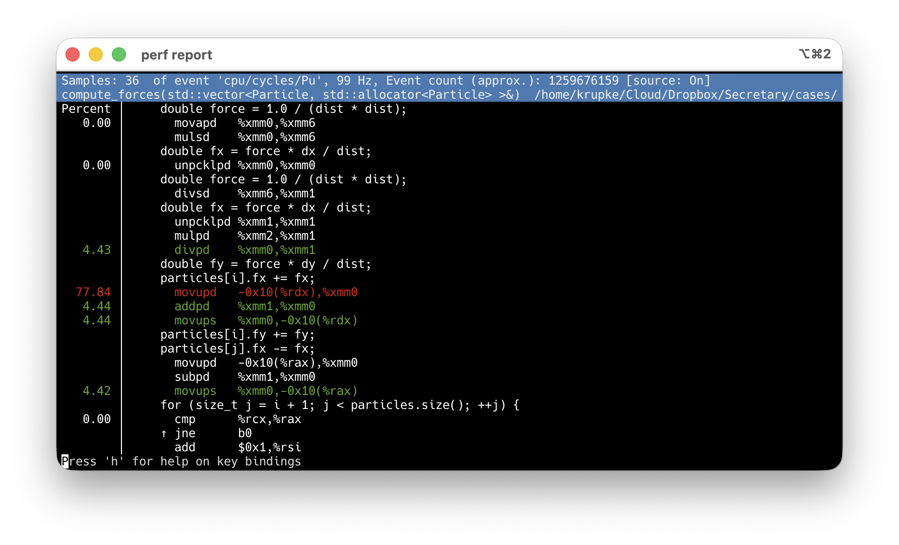

# 07 — `perf record` demo

A minimal particle simulation with an O(n²) force computation hotspot,
designed to produce a clear `perf report` output for teaching.

## Quick start

```bash
make                                              # build with -O2 -g
perf record -F 99 --call-graph dwarf ./particle_sim
perf report                                       # interactive TUI
```

`-F 99` samples at 99 Hz (low overhead, avoids lockstep with timer interrupts).
`--call-graph dwarf` uses DWARF unwinding instead of frame pointers — gives
accurate call stacks even when the compiler omits them.

## Walking through the TUI

### 1. Overview — where is time spent?

`perf report` shows samples grouped by function. `compute_forces` dominates.


### 2. Drill into a hot symbol

Press `Enter` (or `a`) on a function to open the action menu, then choose
**Annotate**:


### 3. Assembly view

By default, annotate opens in assembly-only mode. Sample percentages sit next
to each instruction so you can see which micro-ops are hot:


### 4. Source + assembly (press `s`)

Press **`s`** inside the annotate view to toggle source interleaving. Now you
can read the C++ line alongside the asm it generated, with hotness attributed
per source line:



Useful keys in the annotate view:

| Key | Action |
|-----|--------|
| `s` | toggle source / asm-only |
| `H` | jump to hottest line |
| `t` | cycle percent / period / samples |
| `→` / `Enter` | follow call |
| `←` / `Esc` | go back |
| `h` | full keybinding help |

## perf stat

One-shot hardware counters, no recording needed:

```
  1,338,691,734  cycles
  2,242,484,325  instructions     # ~1.67 IPC — compute-bound
     57,510,430  cache-references
         27,450  cache-misses     # ~0.05% — fits in cache
     80,598,599  branches
         43,290  branch-misses    # ~0.05%
```

High IPC, near-zero cache/branch misses = pure compute bottleneck.
Contrast with the memory-bound example on the `perf stat` slide.

## Troubleshooting

- Source view empty? Rebuild with `-g` and run `perf report` from the directory
  containing `main.cpp`.
- Permission errors on `perf record`: `sudo sysctl kernel.perf_event_paranoid=1`.
- Samples land on the "wrong" instruction (x86 skid)? Use a precise event:
  `perf record -e cycles:pp --call-graph dwarf ./particle_sim`.
